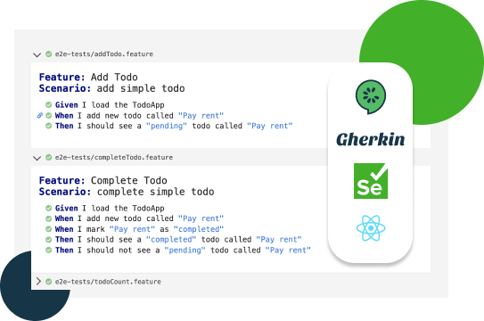

# BDD style Simple Todo App in React

Behavior Driven Development (BDD) style React application using Cucumber.js, Gherkin and Selenium WebDriver



## Features

- Standard React based Todo-App
- End-to-End tests written in Gherkin format
- Cucumber.js test runner
- Selenium-webdriver for `chrome` for browser automation

## Dev Setup

1. Clone the project

```
$ git clone https://github.com/PahanPerera/simple-todo-app-with-bdd.git
$ cd simple-todo-app-with-bdd
```

2. Install dependencies

```
# yarn install
```

3. Run app in localhost

```
$ yarn start
```

4. Run e2e tests (run in new terminal tab)

```
$ yarn e2e
```

5. Open test report

```
$ open e2e-report.html
```
